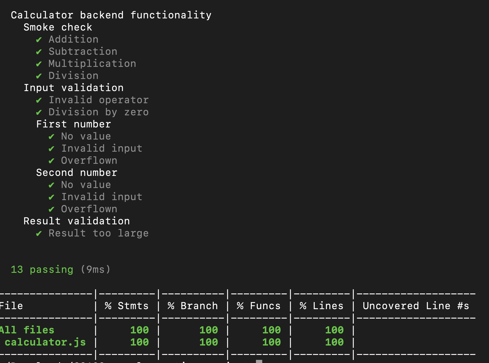

# CS423-sample-testing-project
## What's this?
A simple calculator express app with only 2 numbers and some limited opreators.

This project doesn't serve any purposes of calculation, it is purely used for code coverage testing demonstration.

## Installation
1. Clone this project
2. `npm initialize`

Before you start with this project's unit testing, take a quick look at [Istanbul demonstration code](#demonstration).

## Start server
```
$ node .
App started.
```
Server is running at `localhost:8000`.

Docker sample for this project is currently unavailable.

## Local Code Coverage using Istanbul (c8) and Mocha
```bash
npm test
```
Will show the overall unit test results and coverage of the calculator backend.

Frontend testing is not added yet, as this is only a basic example.

Example output:


## CI/CD through GitHub push and Pull Request (PR)

(TODO)

Fork this repository and try to push any changes in that repository to see changes

For PR, you can either do that on your forked repository or this one to see the Code Coverage result. Note that I don't accept PRs.

## Adding test cases
Test cases are auto-generated from [testcases.json](tests/testcases.json) file.

Test case object example:
```js
{
	"name": "Name of the test",
	// data to input into test cases
	// if you don't specify any of the properties,
	// it will inherit from parent case
	// (or null if it has no parents)
	"data": {
		"a": 1,
		"b": 2,
		"operator": "add"
	},
	// what you expect on this test case
	// this is non-inheritable
	"expects": {
		"errror": false, // whether this test is expected to throw error or not
		"result": 3 // expected result
	},
	"testcases": [
		// define any sub unit-test for this test case
		// objects here have the same format as normal test cases
		// omit this property if this is a unit test
	]
}
```

## Demonstration
All files under the folder `demonstration` folder is for demonstrating usage of Istanbul. They don't belong to the calculator project.

To run the demonstration, use
```bash
npm run demonstrate FILENAME
```
Where `FILENAME` is name of the file to demonstrate

Available files:
- **`introduction`**: Istanbul introduction
- **`statement`**: Statement coverage demo
- **`branch`**: Branch coverage demo
- **`line`**: Line coverage demo
- **`function`**: Functions coverage demo

You may notice there is a blank `package.json` file in the demonstration folder. This is because the sample project is ESM-based, and `nyc` does not support ESM. The blank `package.json` file is to default all JavaScript files inside the folder to be CommonJS-compatible.